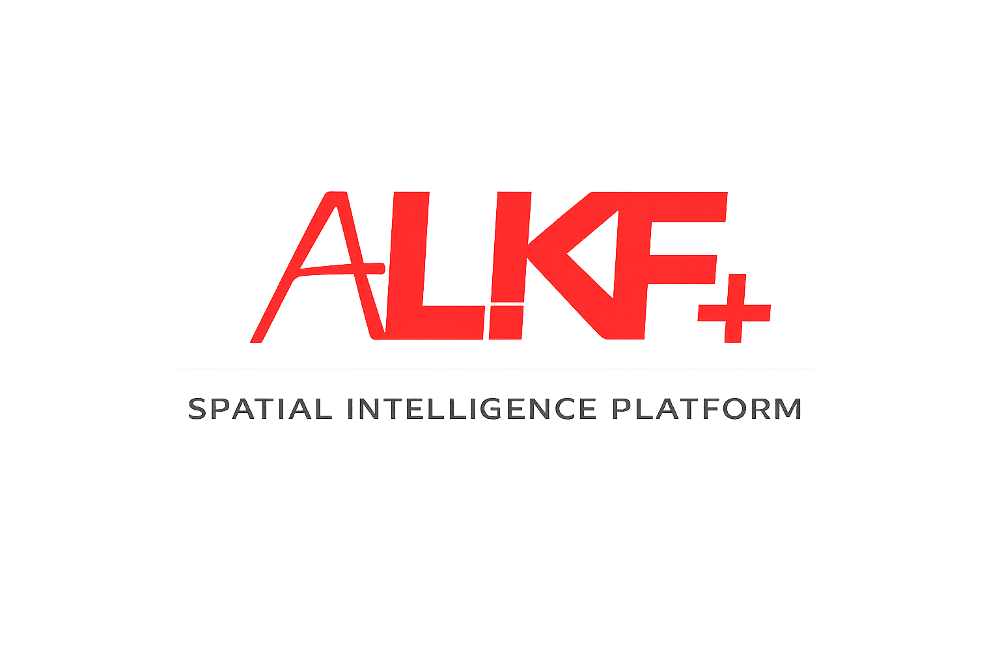
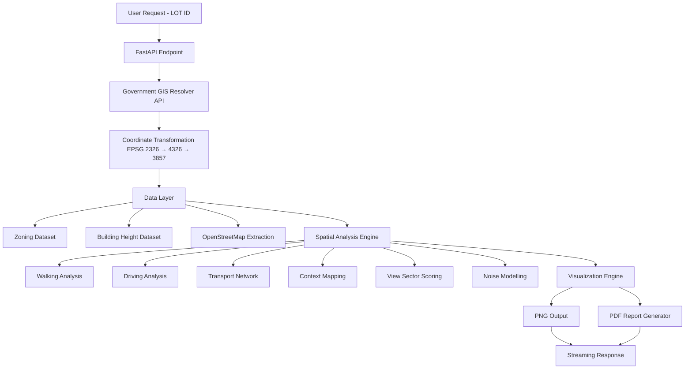
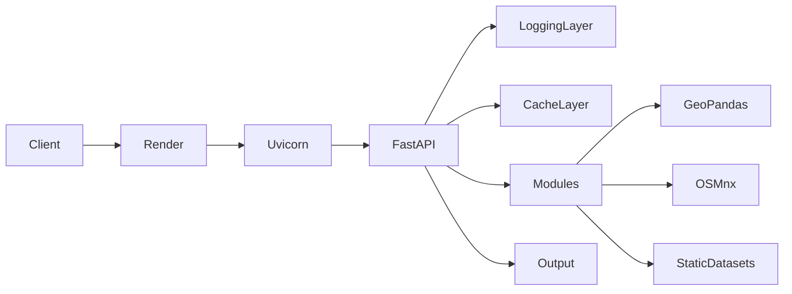

<p>
  
</p>

<h1 style="margin-top:0;">
AUTOMATED SPATIAL INTELLIGENCE SYSTEM API – ALKF+
</h1>
<hr>

# Executive Overview

**Automated Site Analysis – ALKF** is a modular geospatial intelligence system designed to automate professional urban feasibility assessment.

The system converts raw geographic data into high-quality analytical maps and reports through:

- Spatial network analysis
- Environmental modelling
- View sector classification
- Density & zoning intelligence
- Traffic noise propagation modelling
- Automated visualization pipelines
- Cloud-deployed API microservice architecture

Built for urban planners, architects, developers, and infrastructure consultants.

---

# System Architecture

## End-to-End Processing Flow



---

## Cloud Execution Flow



---

# Repository Structure

```
Automated-Site-Analysis-API/
│
├── app.py
├── render.yaml
├── requirements.txt
├── runtime.txt
│
├── data/
│   ├── BUILDINGS_FINAL.gpkg
│   └── ZONE_REDUCED.gpkg
│
├── modules/
│   ├── walking.py
│   ├── driving.py
│   ├── transport.py
│   ├── context.py
│   ├── view.py
│   └── noise.py
```

---

# Module Breakdown

---

## Walking Accessibility Analysis

**Purpose:**  
Evaluate pedestrian connectivity to nearby amenities.

**Core Methods:**
- OSMnx walk graph extraction
- NetworkX shortest path routing
- Amenity clustering
- Service buffer generation

---

## Driving Distance Analysis

**Purpose:**  
Assess vehicular reach and connectivity efficiency.

**Methodology:**
- Drive network extraction
- Travel-time weighted edges
- Isochrone mapping
- Centrality scoring

---

## Transportation Network Analysis

**Purpose:**  
Evaluate public transit accessibility.

**Features:**
- Bus stop mapping
- Transit node density
- Route proximity scoring

---

## Context & Zoning Mapping

**Purpose:**  
Analyze surrounding land-use patterns.

**Includes:**
- Zoning overlay
- Amenity distribution
- Green space mapping
- Density estimation

---

## 360° View Classification Engine

### Methodology

1. Divide 360° into equal sectors  
2. Compute per sector:
   - Green ratio
   - Water ratio
   - Building density
   - Average building height  
3. Normalize all features  
4. Apply scoring model  
5. Merge adjacent sectors  

### Scoring Model

```
Green Score  = green_ratio
Water Score  = water_ratio
City Score   = height_norm × density_norm
Open Score   = (1 - density_norm) × (1 - height_norm)
```

### Output Types

- GREEN VIEW
- WATER VIEW
- CITY VIEW
- OPEN VIEW

---

## Road Traffic Noise Model

### Base Model

```
L = L₀ − 20 log₁₀(r)
```

Where:
- L₀ = Source emission level  
- r = Distance from source  

Extended to include:

- Heavy vehicle correction
- Barrier attenuation
- Ground absorption
- Reflection adjustment
- Grid-based propagation modelling

---

# Implementation Stages

| Stage | Description | Status |
|--------|------------|--------|
| Stage 1 | Multi-Type Input Resolver | ✅ Completed |
| Stage 2 | OSM Data Integration | ✅ Completed |
| Stage 3 | Network Graph Engine | ✅ Completed |
| Stage 4 | View Sector Model | ✅ Completed |
| Stage 5 | Noise Propagation Model | ✅ Completed |
| Stage 6 | Visualization Pipeline | ✅ Completed |
| Stage 7 | Dataset Optimization | ✅ Completed |
| Stage 8 | Modular API Refactor | ✅ Completed |
| Stage 9 | Render Cloud Deployment | ✅ Completed |
| Stage 10 | Caching & Logging Layer | ✅ Completed |
| Stage 11 | PDF Report Generator | ✅ Completed |

---

# API Endpoints

POST `/walking`  
POST `/driving`  
POST `/transport`  
POST `/context`  
POST `/view`  
POST `/noise`  
POST `/report`  

---

## Request Format

```json
{
  "lot_id": "IL 1657"
}
```

---

## Response Types

| Endpoint | Output |
|-----------|--------|
| walking | PNG Image |
| driving | PNG Image |
| transport | PNG Image |
| context | PNG Image |
| view | PNG Image |
| noise | PNG Image |
| report | Combined PDF |

---

# Optimization Strategy

### Dataset Reduction
- Buildings reduced from 342,000+ rows → 42,000
- Removed unused attributes
- Precomputed HEIGHT_M column

### CRS Standardization
All datasets converted to EPSG:3857

### Startup Preloading
Static datasets loaded once during API initialization.

### DPI Optimization
Reduced from 400 → 200 for web efficiency.

### In-Memory Caching
Avoids recomputation for repeated lot requests.

### Modular Separation
Each analysis isolated for maintainability and scalability.

---

# Performance Profile

| Scenario | Response Time |
|----------|--------------|
| Cold Start | 10–15 sec |
| Normal Request | 5–10 sec |
| Cached Request | < 1 sec |

Optimized for Render Free Plan resource limits.

---

# Deployment Configuration

## render.yaml

```yaml
services:
  - type: web
    name: automated-site-analysis-api
    runtime: python
    buildCommand: pip install -r requirements.txt
    startCommand: uvicorn app:app --host 0.0.0.0 --port 10000
    plan: free
    autoDeploy: true
```

---

# Requirements

```
fastapi
uvicorn
geopandas
osmnx
contextily
shapely
pyproj
networkx
numpy
pandas
matplotlib
requests
scikit-learn
reportlab
```

---

# Future Enhancements

- Authentication layer
- Rate limiting
- Batch multi-lot processing
- SaaS dashboard frontend
- Background job queue
- Persistent cloud storage
- Scalable deployment on paid tier

---

# Engineering Significance

This system demonstrates:

- Advanced Geospatial Automation
- Urban Intelligence Modelling
- Network-Based Routing Systems
- Environmental Impact Simulation
- Sector-Based View Classification
- Modular API Architecture
- Cloud-Optimized GIS Deployment

---

© ALKF – Automated Geospatial Intelligence System
