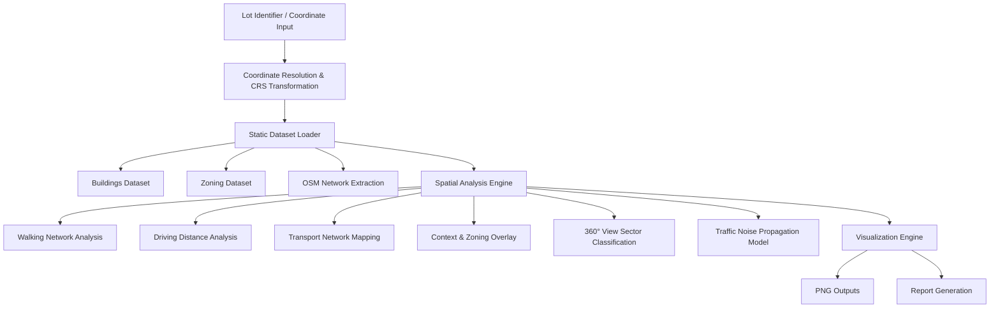

<p>
  
</p>

<h1 style="margin-top:0;">
Computational Geospatial Intelligence Framework
</h1>

<hr>

# Executive Summary

The **Computational Geospatial Intelligence Framework (CGIF)** is a modular Python-based spatial analysis system designed for automated urban feasibility assessment, spatial network modelling, environmental simulation, and multi-layer geospatial intelligence computation.

This framework integrates:

- Network-based accessibility modelling
- Multi-scale spatial analytics
- Environmental noise propagation modelling
- 360° view sector classification
- Zoning and density intelligence
- Automated geospatial visualization pipelines

The system is structured as a computational GIS engine rather than a web application, enabling reproducible, high-performance spatial analysis workflows.

---

# System Architecture

## Computational Pipeline



---

# Repository Structure

```
Computational-Geospatial-Intelligence-Framework/
│
├── MULTIPLE INPUT/
│   ├── automated_site_analysis.py
│   ├── Competing Developments Analysis.py
│   ├── Driving Distance Analysis.py
│   ├── Road Traffic Noise Impact.py
│   ├── Surrounding Amenities & Land Use Context.py
│   ├── Transportation Network Analysis.py
│   ├── Walking Distance.py
│   │
│   └── outputs/
│       ├── *.png (Generated analytical maps)
│
├── README.md
```

The framework operates as a modular spatial analysis engine where each script represents an independent computational component.

---

# Core Analytical Modules

---

## 1. Walking Accessibility Analysis

### Objective
Evaluate pedestrian connectivity to nearby amenities using graph-based routing.

### Computational Methods

- OSMnx walk graph extraction
- NetworkX shortest path computation
- Service area buffer generation
- Amenity density clustering

### Core Algorithm

```
ShortestPath(G, source, target)
ServiceArea = Nodes within threshold distance
```

---

## 2. Driving Distance Analysis

### Objective
Assess vehicular accessibility and travel-time reach.

### Methods

- Drive network graph extraction
- Edge weighting by travel time
- Isochrone polygon generation
- Centrality scoring

---

## 3. Transportation Network Analysis

### Objective
Quantify public transit accessibility.

### Includes

- Bus stop spatial indexing
- Node density scoring
- Route proximity modelling
- Transit coverage visualization

---

## 4. Context & Land Use Intelligence

### Objective
Analyze surrounding zoning and land-use structure.

### Methods

- Polygon intersection via GeoPandas
- Amenity spatial distribution
- Green space ratio computation
- Density estimation

---

## 5. 360° View Sector Classification Engine

### Methodology

1. Divide 360° into equal angular sectors  
2. For each sector compute:
   - Green coverage ratio
   - Water coverage ratio
   - Built-up density
   - Average building height  
3. Normalize feature values  
4. Apply weighted scoring model  
5. Merge adjacent sectors with identical classification  

### Scoring Model

```
Green  = green_ratio
Water  = water_ratio
City   = height_norm × density_norm
Open   = (1 - height_norm) × (1 - density_norm)
```

### Output Categories

- GREEN VIEW
- WATER VIEW
- CITY VIEW
- OPEN VIEW

---

## 6. Road Traffic Noise Propagation Model

### Base Acoustic Model

```
L = L₀ − 20 log₁₀(r)
```

Where:

- L₀ = Source emission level  
- r  = Distance from source  

### Extended Adjustments

```
L_total =
    L
  + HeavyVehicleFactor
  - BarrierAttenuation
  - GroundAbsorption
  + ReflectionCorrection
```

### Simulation Design

- Grid-based propagation (10m resolution)
- Road emission weighting
- Spatial decay modelling
- Heatmap visualization

---

# Data & CRS Strategy

### Coordinate System Workflow

- Input CRS: EPSG:2326
- Geographic: EPSG:4326
- Analysis CRS: EPSG:3857

All spatial datasets standardized to EPSG:3857 for computational consistency.

---

# Performance Optimization Strategy

- Dataset reduction & attribute pruning
- Precomputed building height columns
- Vectorized GeoPandas operations
- Controlled DPI rendering (200)
- Modular execution isolation
- Reduced redundant geometry transformations

---

# Execution Instructions

## Install Dependencies

```
pip install geopandas osmnx networkx shapely pyproj matplotlib numpy pandas contextily scikit-learn reportlab
```

## Run Individual Modules

Example:

```
python "MULTIPLE INPUT/Walking Distance.py"
```

Each module generates PNG outputs in:

```
MULTIPLE INPUT/outputs/
```

---

# Output Artifacts

| Module | Output Type |
|--------|------------|
| Walking | Accessibility Map (PNG) |
| Driving | Isochrone Map (PNG) |
| Transport | Transit Coverage Map (PNG) |
| Context | Zoning & Land Use Map (PNG) |
| View | Sector Classification Map (PNG) |
| Noise | Propagation Heatmap (PNG) |

---

# Computational Characteristics

| Scenario | Execution Time |
|----------|---------------|
| Single Module Run | 5–15 sec |
| Full Multi-Module Execution | 30–60 sec |

Performance depends on OSM extraction size and dataset resolution.

---

# Engineering Significance

This framework demonstrates:

- Advanced computational GIS modelling
- Multi-layer geospatial intelligence integration
- Network-based routing systems
- Environmental impact simulation
- Sector-based visual intelligence classification
- Modular geospatial architecture design
- Reproducible spatial analytics workflow

---

# Future Expansion Roadmap

- Batch multi-lot processing
- Async processing pipeline
- Parallelized spatial computations
- Cloud-native deployment layer
- REST API wrapper (separate repo)
- Interactive dashboard integration

---

# License

Specify license in LICENSE file.

---

© Computational Geospatial Intelligence Framework
