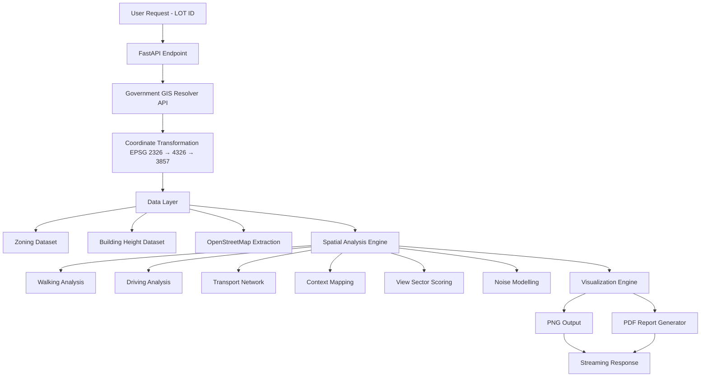
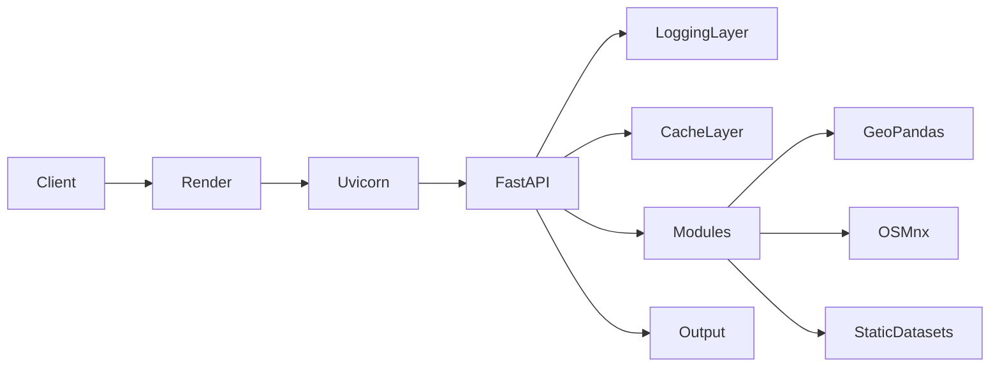
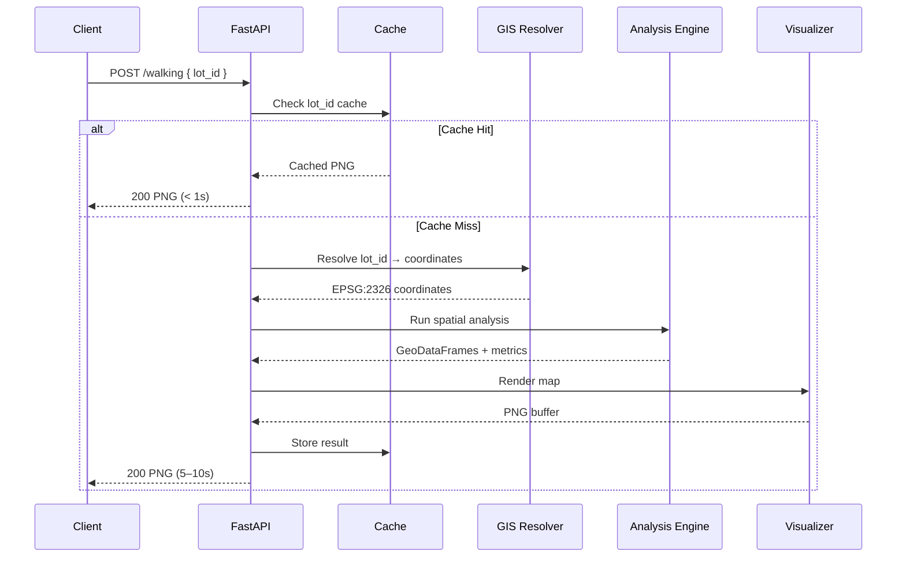

<p>
  
</p>

<h1 style="margin-top:0;">AUTOMATED SPATIAL INTELLIGENCE SYSTEM API – ALKF+</h1>
<hr>

> Modular geospatial intelligence platform for automated urban feasibility assessment. Converts raw geographic lot data into structured analytical maps and PDF reports via a cloud-deployed API.

---

## Table of Contents

1. [Quick Start](#quick-start)
2. [System Architecture](#system-architecture)
3. [Module Breakdown](#module-breakdown)
4. [API Reference](#api-reference)
5. [Deployment](#deployment)
6. [Performance Profile](#performance-profile)
7. [Sample Outputs](#sample-outputs)
8. [Changelog](#changelog)

---

## Quick Start

### Prerequisites

- Python 3.11+
- pip
- Git

### Installation

```bash
# Clone the repository
git clone https://github.com/your-org/automated-site-analysis-api.git
cd automated-site-analysis-api

# Install dependencies
pip install -r requirements.txt

# Start the development server
uvicorn app:app --host 0.0.0.0 --port 10000 --reload
```

The API will be available at `http://localhost:10000`.

### Environment Variables

| Variable | Description | Required | Default |
|----------|-------------|----------|---------|
| `PORT` | Server port | No | `10000` |
| `LOG_LEVEL` | Logging verbosity (`debug`, `info`, `warning`) | No | `info` |
| `CACHE_ENABLED` | Enable in-memory result caching | No | `true` |
| `DPI` | Output image resolution | No | `200` |

### Your First Request

```bash
curl -X POST http://localhost:10000/walking \
  -H "Content-Type: application/json" \
  -d '{"lot_id": "IL 1657"}' \
  --output walking_analysis.png
```

---

## System Architecture

### End-to-End Processing Flow


```mermaid
flowchart TD

A[User Request - LOT ID] --> B[FastAPI Endpoint]
B --> C[Government GIS Resolver API]
C --> D[Coordinate Transformation EPSG 2326 → 4326 → 3857]

D --> E[Data Layer]

E --> E1[Zoning Dataset]
E --> E2[Building Height Dataset]
E --> E3[OpenStreetMap Extraction]

E --> F[Spatial Analysis Engine]

F --> F1[Walking Analysis]
F --> F2[Driving Analysis]
F --> F3[Transport Network]
F --> F4[Context Mapping]
F --> F5[View Sector Scoring]
F --> F6[Noise Modelling]

F --> G[Visualization Engine]

G --> H[PNG Output]
G --> I[PDF Report Generator]

H --> J[Streaming Response]
I --> J
```

### Cloud Execution Flow


```mermaid
flowchart LR

Client --> Render
Render --> Uvicorn
Uvicorn --> FastAPI
FastAPI --> LoggingLayer
FastAPI --> CacheLayer
FastAPI --> Modules
Modules --> GeoPandas
Modules --> OSMnx
Modules --> StaticDatasets
FastAPI --> Output
```

### Request Lifecycle


```mermaid
sequenceDiagram
    participant Client
    participant FastAPI
    participant Cache
    participant GIS Resolver
    participant Analysis Engine
    participant Visualizer

    Client->>FastAPI: POST /walking { lot_id }
    FastAPI->>Cache: Check lot_id cache
    alt Cache Hit
        Cache-->>FastAPI: Cached PNG
        FastAPI-->>Client: 200 PNG (< 1s)
    else Cache Miss
        FastAPI->>GIS Resolver: Resolve lot_id → coordinates
        GIS Resolver-->>FastAPI: EPSG:2326 coordinates
        FastAPI->>Analysis Engine: Run spatial analysis
        Analysis Engine-->>FastAPI: GeoDataFrames + metrics
        FastAPI->>Visualizer: Render map
        Visualizer-->>FastAPI: PNG buffer
        FastAPI->>Cache: Store result
        FastAPI-->>Client: 200 PNG (5–10s)
    end
```

### Repository Structure

```
Automated-Site-Analysis-API/
│
├── app.py                    # FastAPI entrypoint, route definitions, cache + logging init
├── render.yaml               # Render cloud deployment config
├── requirements.txt
├── runtime.txt
│
├── data/
│   ├── BUILDINGS_FINAL.gpkg  # Optimized building footprint dataset (42k rows, EPSG:3857)
│   └── ZONE_REDUCED.gpkg     # Zoning dataset (reduced attributes, EPSG:3857)
│
├── images/
│   └── alkf-logo.png
│
├── static/
│   └── HK_MTR_logo.png
│
└── modules/
    ├── context.py            # Land-use and amenity mapping
    ├── driving.py            # Vehicular isochrone analysis
    ├── noise.py              # Road traffic noise propagation
    ├── resolver.py           # LOT ID → coordinate resolution
    ├── transport.py          # Public transit accessibility
    ├── view.py               # 360° view sector classification
    └── walking.py            # Pedestrian network analysis
```

---

## Module Breakdown

### `resolver.py` — Multi-Type Input Resolver

Translates a human-readable lot identifier (e.g. `IL 1657`) into usable spatial coordinates via the government GIS API.

**Transformation pipeline:**
1. POST lot ID to Government GIS Resolver API
2. Receive raw EPSG:2326 (Hong Kong Grid) coordinates
3. Reproject → EPSG:4326 (WGS84) for OSM queries
4. Reproject → EPSG:3857 (Web Mercator) for internal spatial analysis

**Error handling:** Returns `422 Unprocessable Entity` if the lot ID cannot be resolved (invalid format, unknown lot).

---

### `walking.py` — Pedestrian Accessibility Analysis

Evaluates walkability and proximity to amenities from the site centroid.

**Method:**
1. Extract walk graph from OSMnx within a configurable radius (default: 1,200 m)
2. Snap lot centroid to nearest node
3. Run Dijkstra shortest-path routing to all reachable amenity nodes
4. Classify amenities by type (food, health, education, retail, recreation)
5. Generate 5-minute and 10-minute isochrone buffers
6. Render choropleth map with amenity cluster overlays

**Key parameters:**

| Parameter | Default | Description |
|-----------|---------|-------------|
| Walk speed | 1.39 m/s | Standard pedestrian speed (5 km/h) |
| Graph radius | 1,200 m | OSMnx extraction radius |
| Time thresholds | 5 min, 10 min | Isochrone bands |

---

### `driving.py` — Vehicular Connectivity Analysis

Assesses road network reach and efficiency from the site.

**Method:**
1. Extract drive-mode graph from OSMnx
2. Assign travel-time weights to edges based on posted speed limits
3. Compute isochrones at 5, 10, and 20-minute thresholds
4. Calculate betweenness centrality to identify key road corridors

**Output:** Isochrone polygon map overlaid on a contextual basemap with centrality heatmap.

---

### `transport.py` — Public Transit Accessibility

Scores the site's proximity to and density of public transit infrastructure.

**Method:**
1. Query OSM for bus stops and MTR/rail stations within 800 m
2. Compute transit node density per unit area
3. Score route diversity (number of distinct routes within walking distance)
4. Render node markers scaled by route count

**Scoring:**

```
Transit Score = 0.5 × (node_density_norm) + 0.5 × (route_diversity_norm)
```

---

### `context.py` — Land-Use & Zoning Mapping

Provides a spatial overview of the surrounding land-use environment.

**Layers rendered:**
- Zoning overlay (from `ZONE_REDUCED.gpkg`)
- Amenity point distribution (OSM)
- Green space polygons (parks, recreational areas)
- Building footprint density heatmap
- Road network classification (motorway → footway)

---

### `view.py` — 360° View Classification Engine

Classifies the visual environment from the site across all directions.

**Methodology:**

1. Divide 360° into N equal sectors (default: 36 × 10° sectors)
2. For each sector, extract:
   - **Green ratio** — proportion of OSM green space within sightlines
   - **Water ratio** — proportion of water bodies within sightlines
   - **Building density** — count of building footprints
   - **Average building height** — from `HEIGHT_M` field in `BUILDINGS_FINAL.gpkg`
3. Normalize all features to [0, 1]
4. Apply composite scoring model (see below)
5. Merge adjacent sectors sharing the same dominant view type

**Scoring Model:**

```
Green Score  = green_ratio
Water Score  = water_ratio
City Score   = height_norm × density_norm
Open Score   = (1 - density_norm) × (1 - height_norm)
```

Each sector is labelled with the highest-scoring view type:

| Label | Condition |
|-------|-----------|
| `GREEN VIEW` | Dominant green_ratio |
| `WATER VIEW` | Dominant water_ratio |
| `CITY VIEW` | High density + high height |
| `OPEN VIEW` | Low density + low height |

**Output:** Polar sector diagram with colour-coded view classifications.

---

### `noise.py` — Road Traffic Noise Propagation Model

Simulates noise levels across the surrounding area based on road type and traffic volume.

**Base propagation model:**

```
L = L₀ − 20 log₁₀(r)
```

Where:
- `L₀` — Source emission level (dB), assigned per road class
- `r` — Distance from source (m)

**Source emission levels by road class:**

| Road Class | L₀ (dB) |
|------------|---------|
| Motorway | 78 |
| Primary | 72 |
| Secondary | 68 |
| Tertiary | 64 |
| Residential | 58 |

**Extended correction factors:**
- **Heavy vehicle correction** — +3 dB for motorway/primary roads
- **Barrier attenuation** — building mass reduces propagation across facades
- **Ground absorption** — soft ground surfaces reduce propagation by up to 3 dB
- **Reflection adjustment** — hard surfaces (streets, plazas) add +1–2 dB

**Output:** 50 m × 50 m grid-based noise heatmap (dB scale) with road network overlay.

---

## API Reference

### Base URL

```
https://automated-site-analysis-api.onrender.com
```

### Authentication

No authentication required (current version). See [Future Enhancements](#future-enhancements) for planned auth layer.

---

### Request Format

All endpoints accept `POST` with `Content-Type: application/json`.

```json
{
  "lot_id": "IL 1657"
}
```

**Lot ID formats accepted:**

| Format | Example |
|--------|---------|
| Inland Lot | `IL 1657` |
| New Kowloon Inland Lot | `NKIL 6304` |
| New Territories Lot | `DD 123 LOT 456` |

---

### Endpoints

#### `POST /walking`

Returns a pedestrian accessibility map.

**Request:**
```json
{ "lot_id": "IL 1657" }
```

**Response:** `200 OK` — PNG image stream (`Content-Type: image/png`)

**Errors:**

| Code | Reason |
|------|--------|
| `422` | Invalid or unresolvable lot ID |
| `500` | OSMnx graph extraction failed (network timeout or empty graph) |
| `503` | Government GIS API unavailable |

---

#### `POST /driving`

Returns a vehicular isochrone map.

**Response:** `200 OK` — PNG image stream

---

#### `POST /transport`

Returns a public transit accessibility map with scored bus/rail nodes.

**Response:** `200 OK` — PNG image stream

---

#### `POST /context`

Returns a land-use context map with zoning and amenity overlays.

**Response:** `200 OK` — PNG image stream

---

#### `POST /view`

Returns a 360° polar view classification diagram.

**Response:** `200 OK` — PNG image stream

---

#### `POST /noise`

Returns a grid-based road noise propagation heatmap.

**Response:** `200 OK` — PNG image stream

---

#### `POST /report`

Generates a combined multi-page PDF report containing all six analyses.

**Response:** `200 OK` — PDF stream (`Content-Type: application/pdf`)

**Report page order:**
1. Cover page (lot ID, coordinates, generation timestamp)
2. Context & Zoning map
3. Walking Accessibility map
4. Driving Isochrone map
5. Transport Accessibility map
6. View Classification diagram
7. Noise Propagation map

---

### Example: Full curl Workflow

```bash
BASE="https://automated-site-analysis-api.onrender.com"
LOT='{"lot_id": "IL 1657"}'

# Download all individual maps
curl -s -X POST $BASE/walking  -H "Content-Type: application/json" -d $LOT -o walking.png
curl -s -X POST $BASE/driving  -H "Content-Type: application/json" -d $LOT -o driving.png
curl -s -X POST $BASE/transport -H "Content-Type: application/json" -d $LOT -o transport.png
curl -s -X POST $BASE/context  -H "Content-Type: application/json" -d $LOT -o context.png
curl -s -X POST $BASE/view     -H "Content-Type: application/json" -d $LOT -o view.png
curl -s -X POST $BASE/noise    -H "Content-Type: application/json" -d $LOT -o noise.png

# Download full PDF report
curl -s -X POST $BASE/report   -H "Content-Type: application/json" -d $LOT -o report.pdf
```

---

### Example: Python Client

```python
import requests

BASE_URL = "https://automated-site-analysis-api.onrender.com"

def fetch_analysis(endpoint: str, lot_id: str, output_path: str):
    response = requests.post(
        f"{BASE_URL}/{endpoint}",
        json={"lot_id": lot_id},
        timeout=30
    )
    response.raise_for_status()
    with open(output_path, "wb") as f:
        f.write(response.content)

# Fetch walking map for lot IL 1657
fetch_analysis("walking", "IL 1657", "walking.png")

# Fetch full PDF report
fetch_analysis("report", "IL 1657", "report.pdf")
```

---

## Deployment

### Render (Cloud — Recommended)

The project is pre-configured for [Render](https://render.com) via `render.yaml`.

```yaml
services:
  - type: web
    name: automated-site-analysis-api
    runtime: python
    buildCommand: pip install -r requirements.txt
    startCommand: uvicorn app:app --host 0.0.0.0 --port 10000
    plan: free
    autoDeploy: true
```

**Steps:**
1. Fork this repository
2. Connect your fork to Render via the dashboard
3. Render will detect `render.yaml` and configure automatically
4. Deploy — the service URL will appear in the Render dashboard

**Environment variables on Render:**
Set these in the Render dashboard under **Environment → Environment Variables**:

| Variable | Value |
|----------|-------|
| `PYTHON_VERSION` | `3.11.0` |
| `LOG_LEVEL` | `info` |

---

### Local Development

```bash
# Install dependencies
pip install -r requirements.txt

# Run with hot reload
uvicorn app:app --host 0.0.0.0 --port 10000 --reload

# Run without reload (production-like)
uvicorn app:app --host 0.0.0.0 --port 10000
```

---

### Docker (Optional)

```dockerfile
FROM python:3.11-slim

WORKDIR /app
COPY requirements.txt .
RUN pip install --no-cache-dir -r requirements.txt

COPY . .

EXPOSE 10000
CMD ["uvicorn", "app:app", "--host", "0.0.0.0", "--port", "10000"]
```

```bash
docker build -t alkf-api .
docker run -p 10000:10000 alkf-api
```

---

### Troubleshooting

**Cold start is slow (10–15s)**
This is expected on Render's free plan. The first request after an idle period triggers dataset preloading. Subsequent requests are 5–10s; cached requests are < 1s.

**`OSMnx` graph is empty / `InsufficientResponseError`**
The lot may be in an area with limited OSM road coverage, or the OSMnx API request timed out. Retry or reduce the extraction radius via the `DPI` env var workaround.

**`422 Unprocessable Entity`**
The lot ID format was not recognised or the Government GIS API returned no results. Verify the lot ID string matches one of the accepted formats.

**Port conflict on local**
Change the port: `uvicorn app:app --port 8080`

---

## Performance Profile

| Scenario | Response Time |
|----------|--------------|
| Cold start (first request after idle) | 10–15 sec |
| Normal request (warm server) | 5–10 sec |
| Cached request (same lot ID repeated) | < 1 sec |

### Optimization Details

- **Dataset reduction** — Buildings reduced from 342,000+ → 42,000 rows by stripping unused attributes and precomputing `HEIGHT_M`
- **CRS standardization** — All datasets converted to EPSG:3857 at build time to avoid per-request reprojection
- **Startup preloading** — `.gpkg` files loaded once at API initialization, not per request
- **In-memory caching** — Results keyed by `lot_id` string; invalidated on server restart
- **DPI reduction** — Output images rendered at 200 DPI (down from 400) for faster encoding and smaller payloads

---

## Sample Outputs

> All outputs below generated for lot `IL 1657`.

| Analysis | Output |
|----------|--------|
| Walking Accessibility | Pedestrian isochrone map with amenity cluster markers |
| Driving Isochrone | 5/10/20-min drive-time polygons with centrality heatmap |
| Transport Network | Bus stop and MTR node map scored by route count |
| Context & Zoning | Zoning overlay with green space and amenity distribution |
| 360° View Classification | Polar sector diagram (GREEN / WATER / CITY / OPEN) |
| Noise Propagation | 50m grid heatmap in dB with road type overlay |
| PDF Report | 7-page combined report with cover page |

---

## Implementation Stages

| Stage | Description | Status |
|--------|------------|--------|
| 1 | Multi-Type Input Resolver | ✅ Complete |
| 2 | OSM Data Integration | ✅ Complete |
| 3 | Network Graph Engine | ✅ Complete |
| 4 | View Sector Model | ✅ Complete |
| 5 | Noise Propagation Model | ✅ Complete |
| 6 | Visualization Pipeline | ✅ Complete |
| 7 | Dataset Optimization | ✅ Complete |
| 8 | Modular API Refactor | ✅ Complete |
| 9 | Render Cloud Deployment | ✅ Complete |
| 10 | Caching & Logging Layer | ✅ Complete |
| 11 | PDF Report Generator | ✅ Complete |

---

## Future Enhancements

- API key authentication + rate limiting
- Batch multi-lot processing endpoint
- Background job queue (Celery + Redis) for long-running reports
- Persistent cloud storage for generated assets (S3 / GCS)
- SaaS dashboard frontend (React + Mapbox GL)
- Scalable deployment on Render paid tier or AWS ECS

---

## Requirements

```
fastapi
uvicorn
geopandas
osmnx
contextily
shapely
pyproj
networkx
numpy
pandas
matplotlib
requests
scikit-learn
reportlab
```

---

## Changelog

### v1.1.0
- Added PDF report generator (`/report` endpoint) with 7-page output
- Added in-memory caching layer — repeated lot requests now return in < 1s
- Added structured logging layer with request tracing

### v1.0.0
- Initial release with six analysis modules: walking, driving, transport, context, view, noise
- Render cloud deployment via `render.yaml`
- Building dataset optimized from 342k → 42k rows
- CRS standardized to EPSG:3857 across all datasets
- DPI reduced from 400 → 200 for web-optimized output

---

© ALKF – Automated Geospatial Intelligence System
